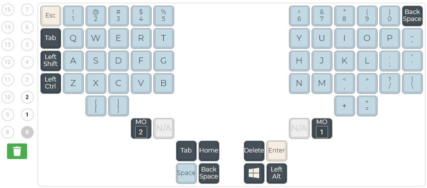

# 1. Introduction

## 1.1 Welcome👋

Thank you for purchasing a [TaikoHub dactyl manuform keyboard](https://taikohub.com/). This user guide will be continuously updated. If you have any questions, please email me anytime at david@taikohub.com. I will try to get back to you as soon as I can.

Please make sure you selected the correct keyboard version on the left. Version refers to the date of shipment. For example, Version 2021-06-24 refers to any keyboard shipped from 2021-06-24 to 2021-09-11. Version 2022-07-01, the most current version, refers to any keyboards shipped after 2022-07-01.

If you are confused about anything or have suggestions on how to improve the documentation, please share it in the GitHub discussions page [here](https://github.com/taikohub/dactyl-manuform-documentation/discussions/categories/general).

## 1.2 Getting started

1. Your keyboard should work without any configurations.&#x20;
2. Connect the audio cord to each side of the keyboard.
3. Connect the USB cord to the **left side** of the keyboard.
4. Your keyboard comes pre-flashed with the default keyboard layout seen in sections 1.1 to 1.3 below.
5. The rest of the documentation discusses how to customize the keyboard. Please read it before customizing the keyboard!


Please read the relevant section in the documentation before you customize the keyboard.



Avoid disconnecting and connecting the audio cord while it is connected to a power source.


## 1.3 Keyboard layout


The MO(1) and MO(2) keys seen in the keyboard layouts in section 1.2 below are also known as LOWER and RAISE keys. These function similar to a SHIFT key on a regular keyboard.


### 1.3.1 Default keyboard layout for size large (6 keyed thumb cluster)

<figure><figcaption>
Layer 0 - Default keymap.
</figcaption></figure>

<figure><figcaption>
Layer 1 - The keymap when you hold MO(1).
</figcaption></figure>

<figure><figcaption>
Layer 2 - The keymap when you hold MO(2).
</figcaption></figure>

### 1.3.2 Default keyboard layout for size medium (5 keyed thumb cluster)

<figure><figcaption>
Layer 0 - Default keymap. If your 5 keyed thumb cluster keyboard was shipped July 12, 2022 or later, it will have the keyboard layout shown above. For keyboards shipped prior to July 12, 2022, please see section 9. CHANGELOG.
</figcaption></figure>

<figure><figcaption>
Layer 1 - The keymap when you hold MO(1).
</figcaption></figure>

<figure><figcaption>
Layer 2 - The keymap when you hold MO(2).
</figcaption></figure>

### 1.3.3 Default keyboard layout for size small (3 keyed thumb cluster)

<figure><figcaption>
Layer 0 - Default keymap.
</figcaption></figure>

<figure><figcaption>
Layer 1 - The keymap when you hold MO(1).
</figcaption></figure>

<figure><figcaption>
Layer 2 - The keymap when you hold MO(2).
</figcaption></figure>
