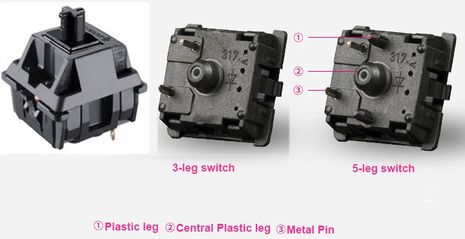

# 2. About Your Keyboard

### 2.1 Compatible keycaps

Compatible keycap profiles (keycap shapes): DSA, XDA, SA Row 3 and MA. The keyboard comes with DSA keycaps.

Keycaps that are 1u in size will fit every key on every keyboard.&#x20;

There is the option to use 1.5u sized keycaps for the 6-keyed thumb cluster, which is able to fit two 1.5u keys on each side of the keyboard. The 3-keyed thumb cluster is also able to fit three 1.5u keys on each side.  The 5-keyed thumb cluster does not fit any 1.5u keys.

### 2.2 Compatible keyswitches for hotswapping

The keyboard is best used with **5 legged switches** (Figure 2.1) although 3 legged switches should still work, it's not officially supported. It is compatible with **MX Cherry switches,** Gateron switches, Holy Panda switches and other similar MX style switches.


Not compatible with Kailh switches and low profile switches.


<figure><figcaption>
Figure 2.1. 5-leg keyswitches are preferred.
</figcaption></figure>

