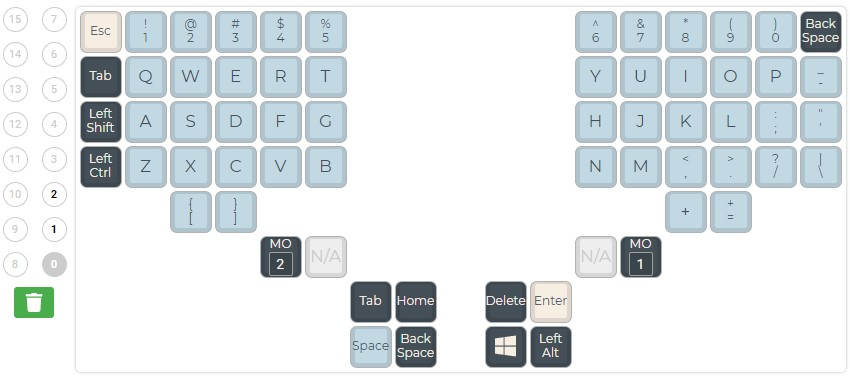
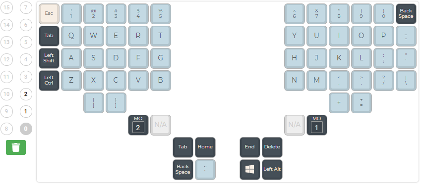
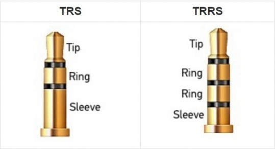

# 11. Changelog

The following describes changes to the [TaikoHub dactyl manuform keyboard](https://taikohub.com).

**2022-07-12**: Medium sized keyboards (keyboards with 5 keyed thumb clusters) shipped July 12, 2022 or later, it's default layer will  have the keymap shown in Figure 9.1. For keyboards shipped prior to July 12, 2022, please see keymap from Version 2022-01-10.

<figure><figcaption>
Figure 11.1. Default keymap layer for medium sized keyboards shipped July 12, 2022 or later.
</figcaption></figure>

<figure><figcaption>
Figure 11.2. Default keymap layer for medium sized keyboards shipped earlier than July 12, 2022.
</figcaption></figure>

**2022-08-01**: All keyboards shipped after Aug 1, 2022 have a TRS port and come with a TRS cord. Though TRRS cords will also work. Keyboards shipped prior to this date have a TRRS port and come with a TRRS cord. TRS cords will not work.

<figure><figcaption>
Figure 11.3 Keyboards shipped Aug 1 2022  or later have a TRS cord. Keyboards shipped prior to Aug 1 2022 have a TRRS port.
</figcaption></figure>

**2022-08-01:** All keyboards shipped after Aug 1, 2022 no longer come with long M3 screws. Screw based tenting no longer officially supported due to lack of interest.
