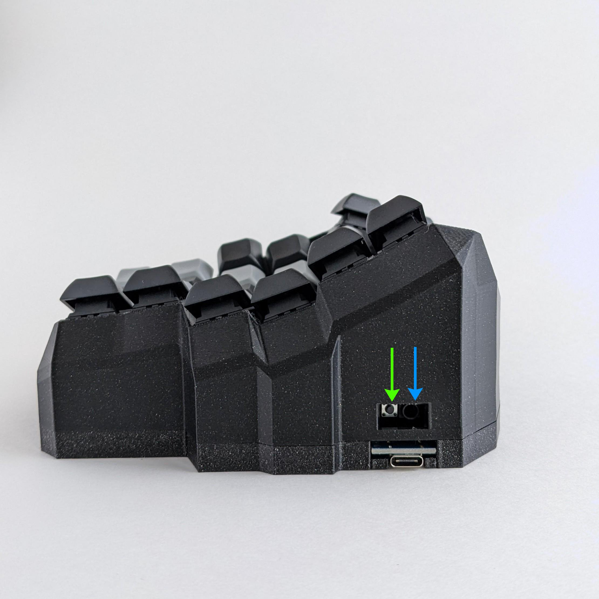

# 4. Customizing Keyboard Layout for Linux with QMK

### 4.1 ✨Instructions


```
Text in code block refers to what is typed into the terminal.
Enter one line at a time.
```


> Text in block quotes refers to the terminal output.

For reference, see the [QMK documentation](https://docs.qmk.fm/).


### 4.2 ⚡QMK CLI - Installing the CLI Tool


```bash
python3 -m pip install --user qmk 
qmk setup
```



### 4.3 ⚡QMK CLI - Test Run the CLI Tool

You can test that QMK CLI is working properly by compiling one of the default keymaps that came with the installation. For instance, we can test clueboard/66/rev3 as below.


```bash
qmk compile -kb clueboard/66/rev3 -km default
```


You should see a message similar to below.

> Linking: .build/clueboard\_66\_rev3\_default.elf \[OK]
>
> Creating load file for flashing: .build/clueboard\_66\_rev3\_default.hex \[OK]
>
> Copying clueboard\_66\_rev3\_default.hex to qmk\_firmware folder > \[OK]
>
> Checking file size of clueboard\_66\_rev3\_default.hex \[OK]
>
> \* The firmware size is fine - 26356/28672 (2316 bytes free)


### 4.4 ⚡QMK CLI - Creating a Custom Keymap


```bash
qmk new-keymap -kb handwired/dactyl_manuform/5x6
```


You'll then be prompted to give a name to the keymap. Here I give it the name `taiko`.&#x20;


### 4.5 📝Keymap  - Editing keymap.c

Edit the keymap.c file with your preferred editor. Here I use nano.


```bash
nano ~/qmk_firmware/keyboards/handwired/dactyl_manuform/5x6/keymaps/taiko/keymap.c
```


While editing your keymap.c, you may wish to look at the following:

<details>

<summary>Example keymap.c - Size Medium (Five Keyed Thumb Cluster)</summary>

Below is an example of a keymap.c file for the size medium keyboard, also known as the five keyed thumb cluster. This file is also available on GitHub [here](https://github.com/taikohub/dactyl-keyboard-keymap/tree/main/five\_keyed\_thumb\_cluster\_keymap).

```clike
//An example of a keymap.c file for the Taikohub dactyl manuform keyboard with five keyed thumb cluster (medium sized).
//
//1. A blank key with no function is indicated by 7 underscores: `________`.
//
//2. The `[_QWERTY]` layer is the default layer.
//
//3. Take note of where the `________` are in the `[_QWERTY]` layer. 
//   The underscores are next to RAISE on the left and before LOWER on the right. 
//   This is because these two keys do not exist on the five keyed thumb cluster.
//   For instance, if you replaced the `_______` with KC_COPY and flashed it on your five keyed thumb cluster keyboard.
//   It would still work. It's just that there would be no key where the KC_COPY should be, 
//   so you wouldn't be able to actually press it.

#include QMK_KEYBOARD_H

#define _QWERTY 0
#define _LOWER 1
#define _RAISE 2

#define RAISE MO(_RAISE)
#define LOWER MO(_LOWER)

const uint16_t PROGMEM keymaps[][MATRIX_ROWS][MATRIX_COLS] = {
    [_QWERTY] = LAYOUT_5x6(
        KC_ESC , KC_1  , KC_2  , KC_3  , KC_4  , KC_5  ,                         KC_6  , KC_7  , KC_8  , KC_9  , KC_0  ,KC_BSPC,
        KC_TAB , KC_Q  , KC_W  , KC_E  , KC_R  , KC_T  ,                         KC_Y  , KC_U  , KC_I  , KC_O  , KC_P  ,KC_MINS,
        KC_LSFT, KC_A  , KC_S  , KC_D  , KC_F  , KC_G  ,                         KC_H  , KC_J  , KC_K  , KC_L  ,KC_SCLN,KC_QUOT,
        KC_LCTL, KC_Z  , KC_X  , KC_C  , KC_V  , KC_B  ,                         KC_N  , KC_M  ,KC_COMM,KC_DOT ,KC_SLSH,KC_BSLASH,
                         KC_LBRC,KC_RBRC,                                                       KC_PLUS, KC_EQL,
                                         RAISE,_______,                        _______, LOWER,
                                         KC_TAB,KC_HOME,                         KC_DEL,  KC_ENT,
                                         KC_SPC, KC_BSPC,                        KC_LGUI, KC_LALT
    ),

    [_LOWER] = LAYOUT_5x6(
        KC_TILD,KC_EXLM, KC_AT ,KC_HASH,KC_DLR ,KC_PERC,                        KC_CIRC,KC_AMPR,KC_ASTR,KC_LPRN,KC_RPRN,KC_DEL,
        _______,_______,_______,_______,_______,KC_LBRC,                        KC_RBRC, KC_P7 , KC_P8 , KC_P9 ,_______,KC_PLUS,
        _______,KC_HOME,KC_PGUP,KC_PGDN,KC_END ,KC_LPRN,                        KC_RPRN, KC_P4 , KC_P5 , KC_P6 ,KC_MINS,KC_PIPE,
        _______,_______,_______,_______,_______,_______,                        _______, KC_P1 , KC_P2 , KC_P3 ,KC_EQL ,KC_UNDS,
                                                _______,KC_PSCR,            _______, KC_P0,
                                                _______,_______,            _______,_______,
                                                _______,_______,            _______,_______,
                                                _______,_______,            _______,_______

    ),

    [_RAISE] = LAYOUT_5x6(
          KC_F12 , KC_F1 , KC_F2 , KC_F3 , KC_F4 , KC_F5 ,                        KC_F6  , KC_F7 , KC_F8 , KC_F9 ,KC_F10 ,KC_F11 ,
          _______,_______,_______,_______,_______,KC_LBRC,                        KC_RBRC,_______,KC_NLCK,KC_INS ,KC_SLCK,KC_MUTE,
          _______,KC_LEFT,KC_UP  ,KC_DOWN,KC_RGHT,KC_LPRN,                        KC_RPRN,KC_MPRV,KC_MPLY,KC_MNXT,_______,KC_VOLU,
          _______,_______,_______,_______,_______,_______,                        _______,_______,_______,_______,_______,KC_VOLD,
                                                  _______,_______,            KC_EQL ,_______,
                                                  _______,_______,            _______,_______,
                                                  _______,_______,            _______,_______,
                                                  _______,_______,            _______,_______
    )
};
```

</details>

<details>

<summary>Example keymap.c - Size Large (Six Keyed Thumb Cluster)</summary>

Below is an example of a keymap.c file for the size large keyboard, also known as the six keyed thumb cluster keyboard. This file is also available on GitHub [here](https://github.com/taikohub/dactyl-keyboard-keymap/blob/main/six\_keyed\_thumb\_cluster\_keymap/keymap.c).

```clike
#include QMK_KEYBOARD_H

#define _QWERTY 0
#define _LOWER 1
#define _RAISE 2

#define RAISE MO(_RAISE)
#define LOWER MO(_LOWER)

const uint16_t PROGMEM keymaps[][MATRIX_ROWS][MATRIX_COLS] = {
    [_QWERTY] = LAYOUT_5x6(
        KC_ESC , KC_1  , KC_2  , KC_3  , KC_4  , KC_5  ,                         KC_6  , KC_7  , KC_8  , KC_9  , KC_0  ,KC_BSPC,
        KC_TAB , KC_Q  , KC_W  , KC_E  , KC_R  , KC_T  ,                         KC_Y  , KC_U  , KC_I  , KC_O  , KC_P  ,KC_MINS,
        KC_LSFT, KC_A  , KC_S  , KC_D  , KC_F  , KC_G  ,                         KC_H  , KC_J  , KC_K  , KC_L  ,KC_SCLN,KC_QUOT,
        KC_LCTL, KC_Z  , KC_X  , KC_C  , KC_V  , KC_B  ,                         KC_N  , KC_M  ,KC_COMM,KC_DOT ,KC_SLSH,KC_BSLASH,
                         KC_LBRC,KC_RBRC,                                                       KC_PLUS, KC_EQL,
                                         RAISE,KC_SPC,                           KC_ENT, LOWER,
                                         KC_TAB,KC_HOME,                         KC_END,  KC_DEL,
                                         KC_BSPC, KC_GRV,                        KC_LGUI, KC_LALT
    ),

    [_LOWER] = LAYOUT_5x6(
        KC_TILD,KC_EXLM, KC_AT ,KC_HASH,KC_DLR ,KC_PERC,                        KC_CIRC,KC_AMPR,KC_ASTR,KC_LPRN,KC_RPRN,KC_DEL,
        _______,_______,_______,_______,_______,KC_LBRC,                        KC_RBRC, KC_P7 , KC_P8 , KC_P9 ,_______,KC_PLUS,
        _______,KC_HOME,KC_PGUP,KC_PGDN,KC_END ,KC_LPRN,                        KC_RPRN, KC_P4 , KC_P5 , KC_P6 ,KC_MINS,KC_PIPE,
        _______,_______,_______,_______,_______,_______,                        _______, KC_P1 , KC_P2 , KC_P3 ,KC_EQL ,KC_UNDS,
                                                _______,KC_PSCR,            _______, KC_P0,
                                                _______,_______,            _______,_______,
                                                _______,_______,            _______,_______,
                                                _______,_______,            _______,_______

    ),

    [_RAISE] = LAYOUT_5x6(
          KC_F12 , KC_F1 , KC_F2 , KC_F3 , KC_F4 , KC_F5 ,                        KC_F6  , KC_F7 , KC_F8 , KC_F9 ,KC_F10 ,KC_F11 ,
          _______,_______,_______,_______,_______,KC_LBRC,                        KC_RBRC,_______,KC_NLCK,KC_INS ,KC_SLCK,KC_MUTE,
          _______,KC_LEFT,KC_UP  ,KC_DOWN,KC_RGHT,KC_LPRN,                        KC_RPRN,KC_MPRV,KC_MPLY,KC_MNXT,_______,KC_VOLU,
          _______,_______,_______,_______,_______,_______,                        _______,_______,_______,_______,_______,KC_VOLD,
                                                  _______,_______,            KC_EQL ,_______,
                                                  _______,_______,            _______,_______,
                                                  _______,_______,            _______,_______,
                                                  _______,_______,            _______,_______
    )
};
Footer

```

</details>

<details>

<summary>Layers - What are they?</summary>

Keyboards flashed with QMK are able use layers, which is a QMK specific functionality.&#x20;

Layers are similar to a Fn or FnLock key that is seen on some keyboards. For reference, see the [Switching and Toggling Layers](https://beta.docs.qmk.fm/using-qmk/software-features/feature\_layers#switching-and-toggling-layers-id-switching-and-toggling-layers) on the QMK website.

Layer keys are what you press on your keyboard to switch to a different layer. The `RAISE` and `LOWER` keycodes raises and lowers the layer, similar to Fn or Shift on a regular keyboard.&#x20;

If you have been following along, look in your current keymap.c file. As an example of how layere keys work, here you must hold "RAISE" and press "P" to get "Scroll Lock" on layer the upper layer. The lower layer works the same way.

A more useful layer key is the DF(layer) key. The DF stands for Default. It is similar to a FnLock key seen on some keyboards. Tapping this key changes your keymapping to the new layer until you decide to switch to a different layer by pressing another DF key.

`[QWERTY] = LAYOUT5x6()` refers to the default base layer.

</details>

<details>

<summary>Keycodes - What are they?</summary>

Keycodes are functions that start with `KC_`.&#x20;

For example, say we want it so that when we press the top left button of our keyboard, it produces an `=` equal sign.

If we look at our current keymap.c, we will see that the keycode furthest to the top left is `KC_ESC` (assuming you have been following along this section). We want to replace `KC_ESC` with the keymap for `=`, so we go to the[ QMK List of Keycodes](https://docs.qmk.fm/#/keycodes) to check.

A quick Ctrl+F for `=` brings us to the following.&#x20;


Now we know to replace `KC_ESC` with `KC_EQUAL`, or its alias `KC_EQL`. After we flash the firmware in section 4.6 with our new keymap.c, the keyswitch to the top left of our keyboard will output `=` .

</details>

<details>

<summary>Keymap Extras - Add non-English languages.</summary>

Add non-English languages to QMK with keymap extras. List of supported languages shown here: [https://github.com/qmk/qmk\_firmware/tree/master/quantum/keymap\_extras](https://github.com/qmk/qmk\_firmware/tree/master/quantum/keymap\_extras).

The below is an example of a `keymap.c` file that includes the `keymap_spanish.h` module. You can also see the gist [here](https://gist.github.com/taikohub/1a0beb8892bf20db36ccbbff81747ba7).


```clike
//This is an example of a keymap.c file where we include an extra module.
//Here we will use the keymap_spanish.h module, seen here: https://github.com/qmk/qmk_firmware/blob/master/quantum/keymap_extras/keymap_spanish.h.
//We'll add the Spanish keycodes to the [_RAISE] layer, also known as the Layer #2. You would press MO(2) to access this layer.
#include QMK_KEYBOARD_H

//Step 1. Include the keymap_spanish.h module after `#include QMK_KEYBOARD_H`
#include "keymap_spanish.h"

#define _QWERTY 0
#define _LOWER 1
#define _RAISE 2

#define RAISE MO(_RAISE)
#define LOWER MO(_LOWER)

const uint16_t PROGMEM keymaps[][MATRIX_ROWS][MATRIX_COLS] = {

    [_QWERTY] = LAYOUT_5x6(
        ...
    ),
    [_LOWER] = LAYOUT_5x6(
        ...
    ),
    [_RAISE] = LAYOUT_5x6(
          //Step 2. You can then add keycodes from the keymap_spanish.h module similar to below.
          //Step 3. You can still use default QMK keycodes such as KC_F10 and KC_F11 seen below.
          ES_MORD, ES_1, ES_2, ES_3, ES_4, ES_5,                                ES_6, ES_7, ES_8, ES_9, ES_0, KC_F10, KC_F11,
          ...
    )
};
```


</details>

Save your keymap.c after you are finished editing.


### 4.6 🖥️Keyboard - Flashing the Firmware

Before you flash the firmware:

* [ ] Disconnect the audio cord from each piece of the keyboard. The audio cord connects to the socket indicated by the blue arrow in Figure 4.1 below.
* [ ] Connect one piece of the keyboard to your computer via USB cord.


Then flash the firmware:


```bash
qmk flash -kb handwired/dactyl_manuform/5x6 -km taiko
```


You should see:

> Detecting USB port, reset your controller now...

When you see "Detecting USB port, reset your controller now..." in the terminal, **click reset button on the keyboard**, as indicated by the green arrow in Figure 4.1. No need to rush, QMK will wait for you.

<figure><figcaption><p>Figure 4.1 The green arrow indicates the reset switch. The blue arrow indicates the socket connecting the two pieces of the keyboard.</p></figcaption></figure>


If it flashes correctly, you should see this message:&#x20;

> avrdude: 18874 bytes of flash verified&#x20;
>
> avrdude: safemode: Fuses OK (E:CB, H:D8, L:FF)&#x20;
>
> avrdude done. Thank you.


### 4.7 🖥️Keyboard - Repeat Section 4.6 For the Other Piece of the Keyboard


### 4.8 🥳Good Work! You Did It!🎉

* Make sure the keyboard is not connected to the computer before reconnecting the audio cord to each piece of the keyboard.
* Connect the USB cord from your computer to the **left** keyboard.&#x20;
* Good work, you did it 🎉!
