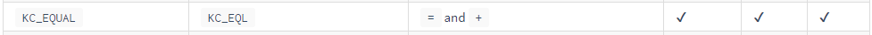

# 4. Customizing Keyboard Layout for Linux

4.1 Instructions

```bash
$ Text after the $ sign refers to what is typed into the terminal.
```

> Text in block quotes refers to the terminal output.

For reference, see the [QMK documentation](https://docs.qmk.fm/).


4.2 Install the QMK CLI tool if you have not used it before

```bash
$ python3 -m pip install --user qmk 
$ qmk setup
```


4.3 Test that the QMK CLI tool works by compiling a keymapping

Here I test it with the clueboard/66/rev3 keymap.

```bash
$ qmk compile -kb clueboard/66/rev3 -km default
```

You should see a message similar to below:

> Linking: .build/clueboard\_66\_rev3\_default.elf \[OK]
>
> Creating load file for flashing: .build/clueboard\_66\_rev3\_default.hex \[OK]
>
> Copying clueboard\_66\_rev3\_default.hex to qmk\_firmware folder > \[OK]
>
> Checking file size of clueboard\_66\_rev3\_default.hex \[OK]
>
> \* The firmware size is fine - 26356/28672 (2316 bytes free)


4.4 Create a custom keymap

```bash
$ qmk new-keymap -kb handwired/dactyl_manuform/5x6
```

You'll then be prompted to give a name to the keymap. Here I give it the name `taiko`.&#x20;


4.5 Edit the keymap.c file with your preferred editor. Here I use nano.

```bash
$ nano ~/qmk_firmware/keyboards/handwired/dactyl_manuform/5x6/keymaps/taiko/keymap.c
```

While editing your keymap.c, you may wish to look at the following:

<details>

<summary>Layers - What are they?</summary>

Keyboards flashed with QMK are able use layers, which is a QMK specific functionality.&#x20;

Layers are similar to a Fn or FnLock key that is seen on some keyboards. For reference, see the [Switching and Toggling Layers](https://beta.docs.qmk.fm/using-qmk/software-features/feature\_layers#switching-and-toggling-layers-id-switching-and-toggling-layers) on the QMK website.

Layer keys are what you press on your keyboard to switch to a different layer. The `RAISE` and `LOWER` keycodes raises and lowers the layer, similar to Fn or Shift on a regular keyboard.&#x20;

If you have been following along, look in your current keymap.c file. As an example of how layere keys work, here you must hold "RAISE" and press "P" to get "Scroll Lock" on layer the upper layer. The lower layer works the same way.

A more useful layer key is the DF(layer) key. The DF stands for Default. It is similar to a FnLock key seen on some keyboards. Tapping this key changes your keymapping to the new layer until you decide to switch to a different layer by pressing another DF key.

`[QWERTY] = LAYOUT5x6()` refers to the default base layer.

</details>

<details>

<summary>Keycodes - What are they?</summary>

Keycodes are functions that start with `KC_`.&#x20;

For example, say we want it so that when we press the top left button of our keyboard, it produces an `=` equal sign.

If we look at our current keymap.c, we will see that the keycode furthest to the top left is `KC_ESC` (assuming you have been following along this section). We want to replace `KC_ESC` with the keymap for `=`, so we go to the[ QMK List of Keycodes](https://docs.qmk.fm/#/keycodes) to check.

A quick Ctrl+F for `=` brings us to the following.&#x20;



Now we know to replace `KC_ESC` with `KC_EQUAL`, or its alias `KC_EQL`. After we flash the firmware in section 4.6 with our new keymap.c, the keyswitch to the top left of our keyboard will output `=` .

</details>

Save your keymap.c after you are finished editing.


4.6 Flash the firmware

Before you flash the firmware, ensure you have:

* [ ] Disconnect the audio cord from each piece of the keyboard. The audio cord connects to the socket indicated by the blue arrow in Figure 4.2 below.
* [ ] Connected one piece of the keyboard to your computer via USB cord


Then flash the firmware:

```bash
$ qmk flash -kb handwired/dactyl_manuform/5x6 -km taiko
```

You should see:

> Detecting USB port, reset your controller now...

When you see "Detecting USB port, reset your controller now..." in the terminal, **click the keyboard reset button**, as indicated by the green arrow in Figure 4.2.


If it flashes correctly, you should see this message:&#x20;

> avrdude: 18874 bytes of flash verified&#x20;
>
> avrdude: safemode: Fuses OK (E:CB, H:D8, L:FF)&#x20;
>
> avrdude done. Thank you.


4.7 Repeat section 4.6 with the other piece of the keyboard


4.8 Before using the keyboard

Make sure no keyboard is connected to your computer before attaching the audio cord to each piece of the keyboard. Afterwards, your keyboard is ready to go. Simply connect the USB cord from your computer to the **left** keyboard. Good work, you did it 🥳!
