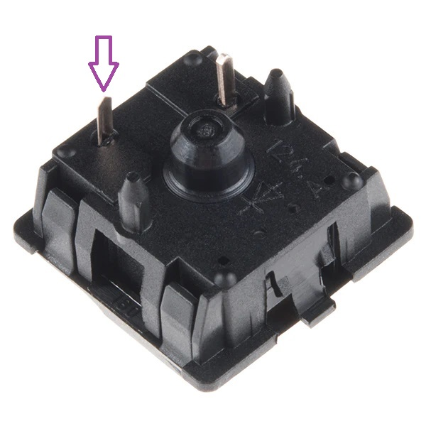
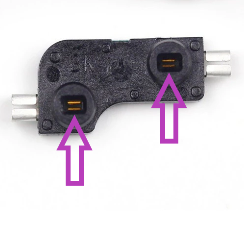
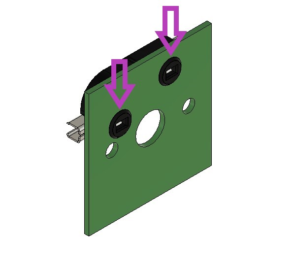
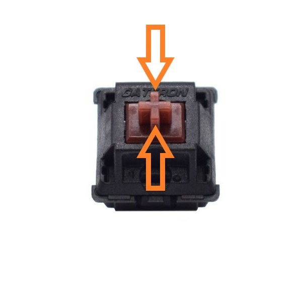

# 6. Hot Swapping Keyswitches

6.1 Hotswapping

Hotswapping refers to swapping out components while your keyboard is connected to your computer or another power source. Hotswapping keyswitches is safe and has been tested countless times. But you should **not** hotswap microcontrollers, as noted in Section 7.&#x20;

6.2 Necessary tools and components

* Keyswitches: **5-legged MX style keyswitches** are recommended. MX Cherry and Gaterons are officially supported. But it should work with most MX style switches.
* Keyswitch puller
* Keycap puller


Not compatible with Kailh switches and low profile switches.


5.2 Hotswapping demo


Video 6.1 Full Demo of Hotswapping a TaikoHub Dactyl Manuform Keyboard



Video 6.2 Short Hotswapping demo.



Video 6.3 Another short hotswap demo.



Hotswap up to one row of keyswitch at a time to avoid any issues.

The PCB is stabilized by the keyswitches. Removing one row of keyswitch at a time will minimize movement of the PCB and avoid any hassle. Please don't remove every keyswitch all at once.


5.3 Summary

1. Remove all the keycaps with the keycap puller.
2. Remove a single row of keyswitch at a time.
3. Pull out the keyswitch with a keyswitch puller, it should not take a lot of force. If the keyswitch is not coming out, try orienting it from a different angle. It may help to pull it in a curved motion.
4. &#x20;Insert the new keyswitch.

5.4 Tips



* In order for the keyswitch to make an electrical connection with the PCB, the metal pins on the keyswitch seen in Figure 5.1 needs to slide between the two metal foils in the hotswap socket seen in Figure 5.2A.
* The purple arrow in Figure 5.2.A and Figure 5.2.B points to the thinner, more flexible, metal pin on the keyswitch. This pin is harder to align. If this is aligned, the other stiffer metal pin is generally not a problem.&#x20;

<figure><figcaption>
Figure 5.1 Purple arrow points to the thinner, more flexible, metal pin. There generally shouldn't be any issues as long as this pin is aligned when inserting the new keyswitch.
</figcaption></figure>

<figure><figcaption>
Figure 5.2.A The purple arrows point to the metal foils in the hotswap socket. The metal pins on the keyswitch need to slide between the foils.
</figcaption></figure>

 

<figure><figcaption>
Figure 5.2.B Side view of the PCB. The purple arrows point to the metal foils in the hotswap socket.
</figcaption></figure>




* The orange arrows in Figure 5.3 point to where I prefer to hold the keyswitch while aligning it.
* The easiest way to determine whether the keyswitch inserted properly is have it plugged into your computer. Push on the keyswitch before fully locking it into the keyboard. If it outputs a value onto the computer, it's been inserted properly&#x20;
* Then push the keyswitch all the way in.

<figure><figcaption>
Figure 5.3 The orange arrows point to where I prefer to hold the keyswitch while aligning it.
</figcaption></figure>



