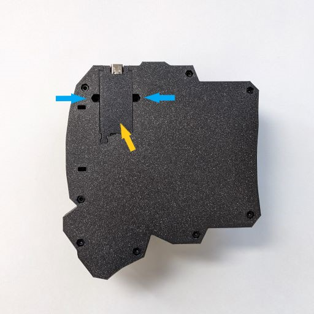
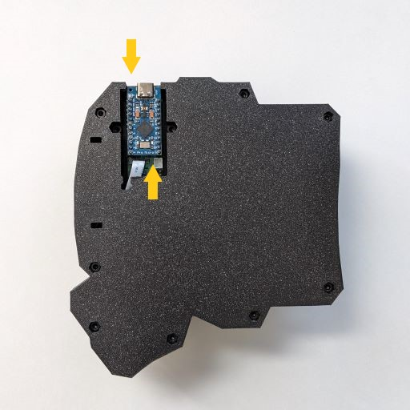
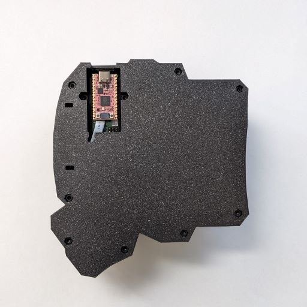

# 7. Swapping Microcontrollers

7.1 Microcontrollers

A microcontroller is a small device that controls your keyboard. Each piece of your keyboard comes with a Pro Micro microcontroller. You may come across it abbreviated as MCU, which stands for MicroController Unit.

7.2 Why swap microcontrollers?

The main reason to swap microcontrollers is to add new features. For example, you may want to use a nice!nano microcontroller to add Bluetooth functionality. Or you may want to use a Adafruit KB2040, which uses a more powerful RP2040 chip, to add very complex macros.&#x20;


Unplug any cords or batteries before swapping your microcontrollers.


7.3 Necessary tools and components

* 3mm Allen key
* Two new microcontrollers
  * These need to have a similar footprint to the Arduino Pro Micro.&#x20;
  * Compatible microcontrollers includes Adafruit KB2040, nice!nano, among many others.&#x20;


Not compatible with BlueMicro840 V1.0.


7.4. Swapping microcontrollers

a. Remove all power source from your keyboard. Unplug any cords or batteries.

b. Take off the plastic cover on the base plate of the keyboard, indicated by the yellow arrow in Figure 7.2. You can use a pen or an Allen key to **gently** wedge it out from the sides, as indicated by the blue arrows in Figure 7.2.A You should take turns wedging from each side.

<figure><figcaption>
Figure 7.2.A Take off the cover for the microcontroller indicated by the yellow arrow. You may need to use a pen to gently wedge on either side of the cover, indicated by the blue arrows.
</figcaption></figure>

c. Remove the microcontroller that came with the keyboard. Hold the microcontrollers by the top and bottom as indicated by the yellow arrows on Figure 7.3. Then gently wiggle it out.&#x20;

<figure><figcaption>
Figure 7.3. Put your fingers on each side of the microcontroller indicated by the yellow arrows, then gently wiggle it out.
</figcaption></figure>

d. **Gently** plug in your own microcontroller. Note that some microcontrollers will require you to solder pin headers onto them.

<figure><figcaption>
Figure 7.4. Insert the new microcontroller. Adafruit KB2040 is shown here.
</figcaption></figure>

e. Some microcontrollers, such as the KB2040, are slightly smaller than the microcontroller that came with your keyboard. If you want the USB-C port closer to the front of the keyboard, you need to open up the baseplate to slide the microcontroller forward. Put the cover back on and you're finished 🎉!
