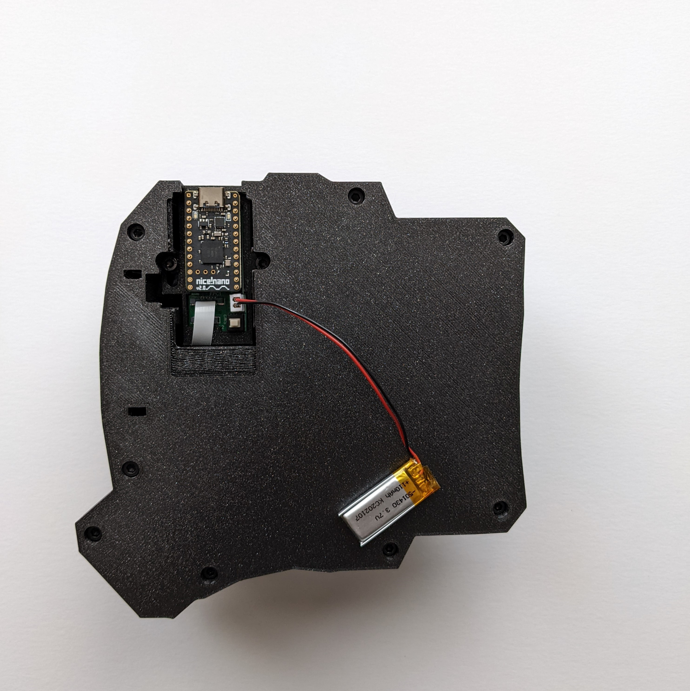

# 7.1 Swapping Microcontrollers: Bluetooth


Unplug any cords or batteries before swapping your microcontrollers.



QMK does not work well with Bluetooth. ZMK should be used instead.


7.1.1 Necessary tools and components

* [ ] 3mm Allen key
* [ ] 2 x Microcontroller that support Bluetooth. The nice!nano V2 is officially supported, but most microcontrollers with a footprint similar to the Arduino Pro Micro should work. <mark style="color:red;">Not compatible with BlueMicro840 V1.0.</mark>
* [ ] &#x20;2 x LiPo batteries with 2-Pin JST-PH. It's safest to get them from [Adafruit ](https://www.adafruit.com/product/1570)or [Sparkfun](https://www.sparkfun.com/products/13853).
* [ ] If your keyboard shipped before 2022-08-01, you will also need either 2 On-Off switches or 2 wires with female pin headers on both ends. See[#choice-1-add-a-switch-onto-the-keyboard](swapping-microcontrollers.md#choice-1-add-a-switch-onto-the-keyboard "mention") for details.


Double check the LiPo battery for your microcontroller! Different microcontrollers may require different batteries. <mark style="color:red;">**Using the wrong battery can lead to**</mark> <mark style="color:red;">**explosions**</mark>!

Make sure that your JST-PH is correctly wired! The black wire and red wire should be in the correct orientation on the JST-PH connector, as shown in Figure 7.1.1.&#x20;

It's recommended you use batteries from Adafruit or Sparkfun. You can use other vendors, but note that some vendors sell LiPo batteries with their wires reversed. See video on this issue by Adafruit [here](https://www.youtube.com/watch?v=ILArrTIMFyM).


<figure><figcaption>
Figure 7.1.1 Orient your JST connector same way as the photo above. The black wire should be on the right and red should be on the left.
</figcaption></figure>

 

<figure><figcaption>
Figure 7.1.2. This 3.7V 110mAh LiPo battery worked with nice!nano's during testing.
</figcaption></figure>

7.1.2 Adding Bluetooth



If your keyboard shipped after 2022-08-01, follow the steps below.

### **Step 1**

Remove the plastic cover and take out the default microcontroller that came with the keyboard.

<figure><figcaption>
Figure 7.1.2.1 Step 1 - Take out the default microcontroller that came with the keyboard.
</figcaption></figure>

### **Step 2**&#x20;

Insert the Bluetooth enabled microcontroller.

Optional: If you want the USB-C port to be closer to the edge of the keyboard, you can loosen the screws counterclockwise with an 3mm Allen Key by a half circle. Then slide the PCB forward. Tighten the screw again afterwards by turning it clockwise.

<figure><figcaption>
Figure 7.1.2.2 Step 2 - Insert the new Bluetooth enabled microcontroller. If you want the USB-C port to be closer to the edge of the keyboard, you can loosen the screws.
</figcaption></figure>

### **Step 3**

Insert the LiPo battery.&#x20;

No special instructions for inserting the battery. As long as you obtained the correct battery, the connector will insert correctly. This is because the JST-PH socket can only accept the battery header in one direction.

<figure><figcaption>
Figure 7.1.2.3 Step 3 - Insert the new Bluetooth enabled microcontroller and the LiPo battery.
</figcaption></figure>

### **Step 4**

Put the cover back on. You did it 🎉! Proceed to the section on flashing your keyboard with ZMK.

<figure><figcaption>
Figure 7.1.2.4 Step 4 - Put the cover back on.
</figcaption></figure>



### **Step 1**

If your keyboard was shipped prior to 2022-08-01, you have 2 choices.

#### **Choice 1: Add a switch onto the keyboard**

* [ ] 2 x On-Off switches with wires attached. Compatible switches include [toggle switch](https://www.amazon.com/STARELO-Rocker-Switch-Latching-Pre-Wired/dp/B09BKXVCQ8/ref=sr\_1\_14?crid=10ULQMILV856\&keywords=latching+switch\&qid=1661997333\&sprefix=latching+switch%2Caps%2C105\&sr=8-14), [latching switch](https://www.amazon.com/Twidec-Latching-Self-Locking-Pre-soldered-L-PBS-110-XBK/dp/B086QTH8RW/ref=sr\_1\_5?crid=10ULQMILV856\&keywords=latching+switch\&qid=1661997312\&sprefix=latching+switch%2Caps%2C105\&sr=8-5) or slide switch. Momentary switches will not work.
* [ ] A Dupont connector kit such as this [one ](https://www.amazon.com/Connector-Crimper-Connectors-Ratcheting-AWG28-18/dp/B0B4BKX3H6/ref=sr\_1\_1\_sspa?crid=24D9U7IQM19EH\&keywords=crimping+tool+female+pin+header\&qid=1661997633\&sprefix=crimping+tool+female+pin+heade%2Caps%2C105\&sr=8-1-spons\&psc=1\&spLa=ZW5jcnlwdGVkUXVhbGlmaWVyPUEyVk9ZRzBYSk1HN1dGJmVuY3J5cHRlZElkPUExMDQ2NjA0MVpIWFJTREVMN1E5JmVuY3J5cHRlZEFkSWQ9QTAxNTY4MDkzTVRPRllMS0U0MDkyJndpZGdldE5hbWU9c3BfYXRmJmFjdGlvbj1jbGlja1JlZGlyZWN0JmRvTm90TG9nQ2xpY2s9dHJ1ZQ==)will include the necessary tools below:
  * [ ] Crimping tool
  * [ ] 2 x female 2-pin header shells
  * [ ] 2 x female 2-pin header pins

Crimp the Dupont connectors onto the On-Off switch. To see how this is done, check [this excellent guide from **I**nstructables](https://www.instructables.com/Make-a-Good-Dupont-Pin-Crimp-EVERY-TIME/).

<figure><figcaption>
Latching switch
</figcaption></figure>

 

<figure><figcaption>
Toggle switch
</figcaption></figure>

#### **Choice 2: Use a wire**

* [ ] 2 x Wire with female pin headers on both ends

It's not the most exciting, but it works. Although the keyboard would remain 'ON' until you disconnect the wire or the battery runs out.

<figure><figcaption>
Wire with female 2-pin headers on both sides.
</figcaption></figure>

### Step 2

a. Swap in your Bluetooth enabled microcontroller.

b. Attach the LiPo battery to the JST-PH socket indicated by the green arrow in Figure 7.7.

<figure><figcaption>
Figure 7.7. Keyboard with nice!nano microcontroller. Green arrow indicates the JST-PH socket for the Lipo battery. Purple arrow indicates pin headers for the on-off switch.
</figcaption></figure>

c. Attach the female pin headers of the on-off switch as indicated by the purple arrow in Figure 7.7. It should attach to the two male pin headers on the top right as indicated by the red arrows in Figure 7.8. The orientation doesn't matter.&#x20;

If you are using a wire, connect one end to position 1 and another to position 3 as indicated in Figure 7.8. Note that if you use a wire, the keyboard would remain 'ON' until you disconnect the wire.

<figure><figcaption>
Figure 7.8. Attach the on-off switch to the two male pin headers on the top right as indicated by the red arrows.
</figcaption></figure>

d. Put the cover back on. You did it 🎉! Proceed to the section on flashing your keyboard with ZMK.



