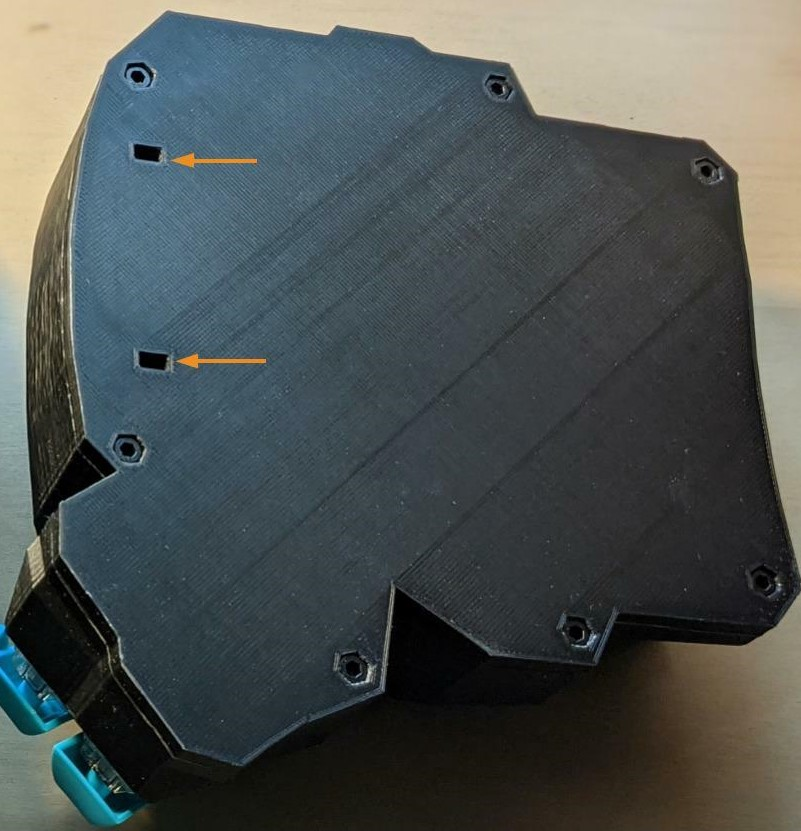
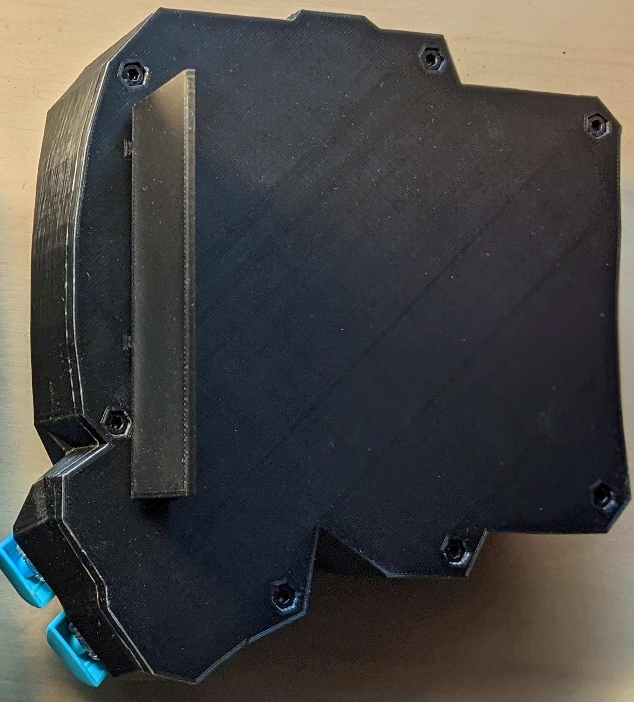
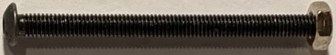
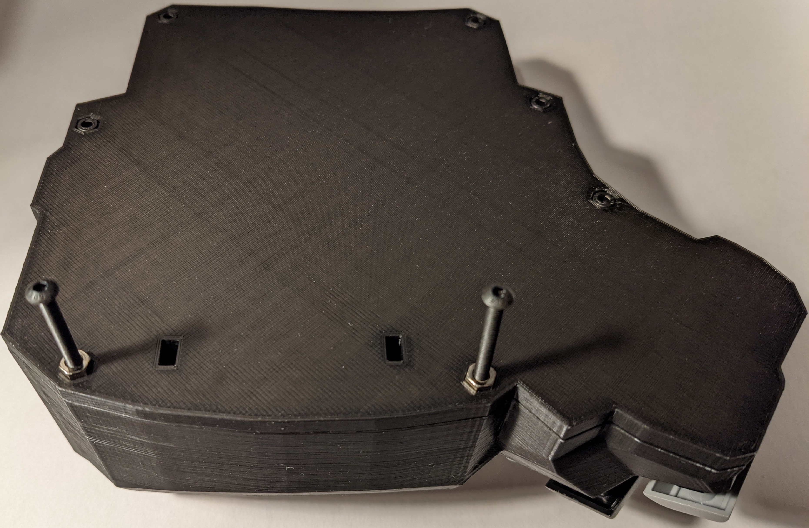

# 8. Tenting Your Keyboard

8.1 Tenting your keyboard with plastic attachments

Insert the plastic attachments into the slots on the base plate. It's a tight fit so it helps to wiggle it in. Similarly, the attachments should be removed by wigging them out.

<figure><figcaption>
Figure 8.1. Slots for the plastic attachment
</figcaption></figure>

<figure><figcaption>
Figure 8.2. Base plate with plastic attachment inserted partially to illustrate the insertion.
</figcaption></figure>

8.2 Tenting your keyboard with screws

If you want to adjust the tenting to an exact angle, you can replace the two M3 screws with longer screws at your preferred length. The screws that came assembled with the keyboard are 6mm in length. Long screws are included with your keyboard.

&#x20;

First, unscrew the two 6mm M3 screws that came assembled with your keyboard with a 3mm [Allen Key](https://en.wikipedia.org/wiki/Hex\_key).&#x20;

<figure><figcaption>
Figure 8.3. These two M3 screws can be replaced with the long screws. 
</figcaption></figure>

Second, screw the hex nuts onto the tip of the long M3 screws so that it's easier to push them into the base plate.

<figure><figcaption>
Figure 8.4. Screw the hex nuts onto the tip of the long M3 screws.
</figcaption></figure>

Push the hex nuts into the base plate. Finally, tighten the long M3 screws until they do not wobble. There is another hex nut on the inside of the base plate, when the long screw goes inside that hex nut, it will no longer wobble. Adjust the screws to change the degree of tenting to your liking.

<figure><figcaption>
Figure 8.5 Push in the hex nuts and tighten the long screws.
</figcaption></figure>

